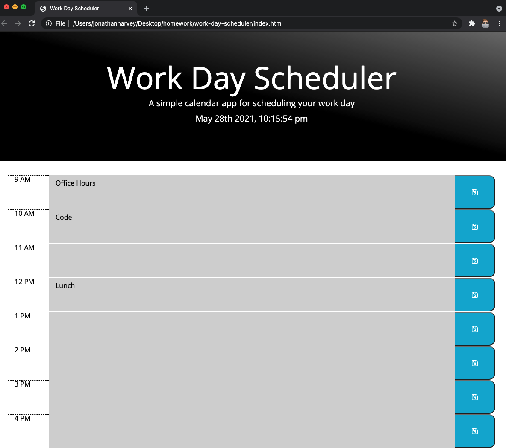

# Work Day Scheduler

## Background

This is a homework assignment for UofT Bootcamp.  Below is the story and acceptance criteria for reference.

## User Story

```md
AS AN employee with a busy schedule
I WANT to add important events to a daily planner
SO THAT I can manage my time effectively
```

## Acceptance Criteria

```md
GIVEN I am using a daily planner to create a schedule
WHEN I open the planner
THEN the current day is displayed at the top of the calendar
WHEN I scroll down
THEN I am presented with timeblocks for standard business hours
WHEN I view the timeblocks for that day
THEN each timeblock is color coded to indicate whether it is in the past, present, or future
WHEN I click into a timeblock
THEN I can enter an event
WHEN I click the save button for that timeblock
THEN the text for that event is saved in local storage
WHEN I refresh the page
THEN the saved events persist
```

## Process

* The HTML was partially completed and needed the time blocks to be added using Bootstrap grid.
* The CSS was already completed and the classes needed to be added to the elements.  I made minor styling changes.
* This homework was to be done at the end of our Thrid Party APIs module, so I did my best to use jQuery as much as possible.
* I started with getting the date and time displayed with moment.js, then I moved into getting the colour coding for time (past, present, and future), after that I moved into saving what is written into the text area in local storage, and finally finishing with keeping that text displayed when the page was refreshed.

## Screen Shot



## Link
